<div align="center">

# Signal Room Starter

### A private creator-intelligence workspace for Instagram reels.

**Convex persistence · Apify Instagram connector · Local Codex bridge · Agent-ready documentation**

[Quick start](#quick-start) · [Architecture](#the-system-at-a-glance) · [Make it yours](#make-it-yours) · [Security boundary](#the-public-private-boundary)

**Public copy for the EA 30-Day Challenge.** The original Signal Room repo stays private ([ADR-0006](docs/adr/0006-repo-ist-privates-produkt.md)); this copy was cleaned before publishing (see below).

</div>

## 30-Day Challenge: what was built during the challenge

To keep this honest: **Signal Room itself was built before the challenge.** Discover, Briefing, Production slate, Trend Radar, Hooks and Scripts are older work. The last commit before the challenge is from 18 Sep 2026 and sits on the branch [`vor-der-challenge`](../../tree/vor-der-challenge). The first three commits are Mark Kashef's clean-room starter.

**During the challenge only the Skript-Board was built:** a self-hosted, Poppy-style script board under `/board`. It is stage 2 of [YouTube-OS](https://github.com/christophercallejongarcia/YT-OS): paste 2 or 3 outlier videos, connect them and your own notes to a chat, and write hooks, titles and a script with Claude Code, Codex or Command Code running on your own subscriptions.

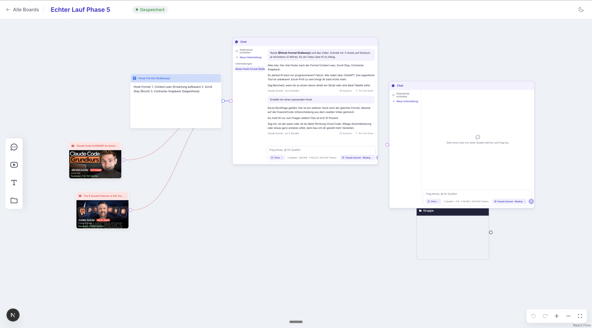

| | |
|---|---|
| Challenge commits | 9 commits on 27 Sep 2026, Phase 0a to Phase 5 ([compare](../../compare/vor-der-challenge...main)) |
| Not public | Research and the build plan (26/27 Sep, five adversarial review rounds with Codex). They contain screenshots and notes about the original app, so they stay private. Code comments refer to its numbered points ("PLAN.md point 34"). |
| Size | about 200 files, 22,000 lines added |
| Tests | 548 unit and bridge tests, 50 Convex tests, 26 Playwright end-to-end tests, all green on 27 Sep 2026 |

What works today (Phase 5):

- Board list, canvas with text, YouTube and group nodes, context edges, undo, light and dark theme
- YouTube node: paste a link, the transcript, views and channel factor arrive via `yt-dlp` (Apify as paid fallback)
- Chat node: several conversations, `@` mentions of connected sources, model and effort choice, brand voice, context size against each model's budget, streaming, stop, "as text node"
- Engines only run inside a macOS sandbox with no tools, gated per engine version
- Nothing gets lost: every edit is journaled in the browser first; every chat answer is journaled on disk before Convex and delivered later if Next or Convex go down

Still open (planned): clickable title options, prompt library, export of `skript.md` and `beats.md` to YouTube-OS, document nodes for playbooks.

Run it: `npm run dev:board` (local Convex deployment, logged-in `claude`, `codex` or `command-code`), then open `http://127.0.0.1:3100/board`. Checks: `npm run check`, `npm run test:e2e:board`, `npm run board:doctor`.

### Signal Room today (built before the challenge)

These screens show the existing Signal Room with its real data: 4,756 tracked Instagram reels from 45 channels, 3,226 visual reads. Thumbnails, faces, handles, captions and reel codes are blurred because they belong to other creators. **Today Signal Room is built for Instagram reels; it is being rebuilt for YouTube** as the research stage of YouTube-OS.

| Discover | Briefing |
|---|---|
| 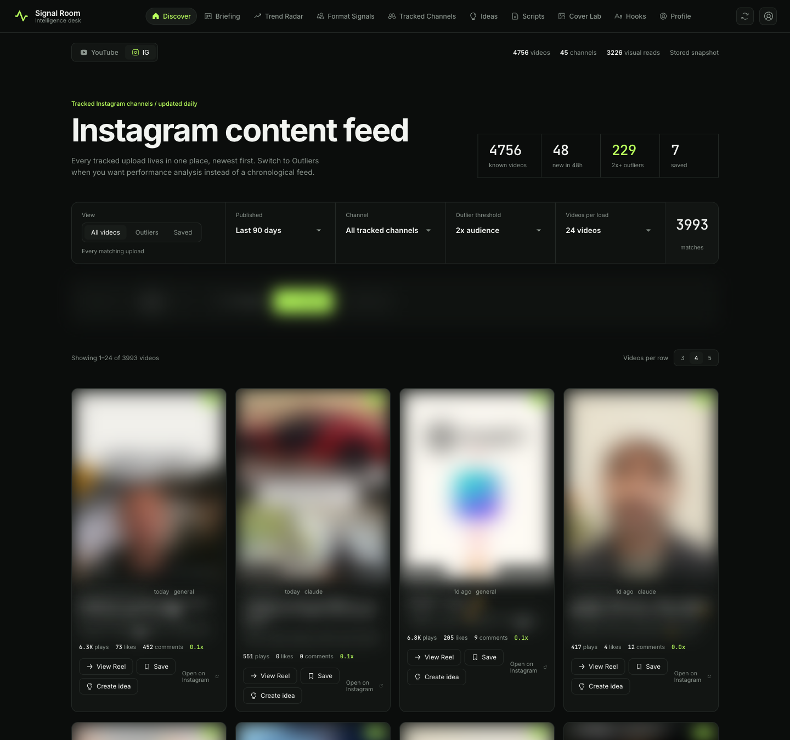 | 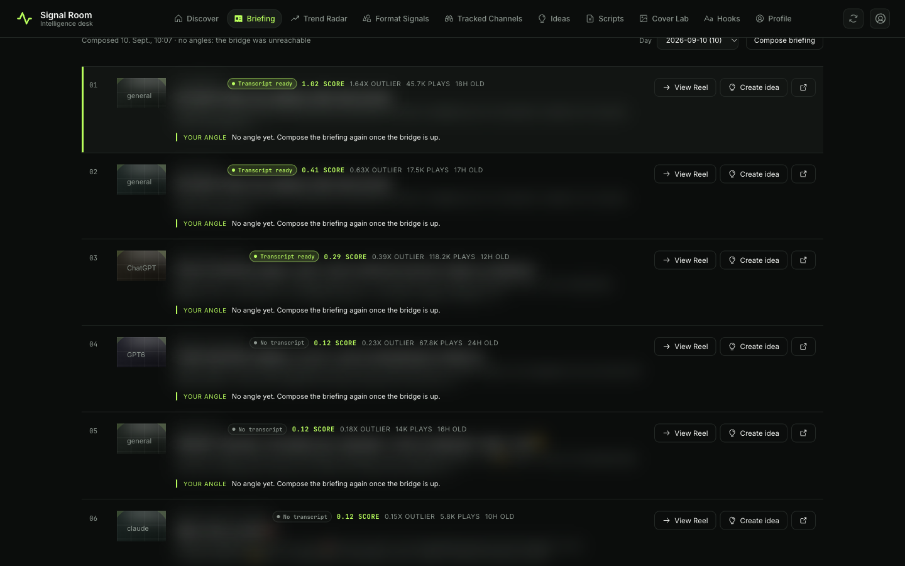 |
| **Format Signals** | **Ideas** |
| 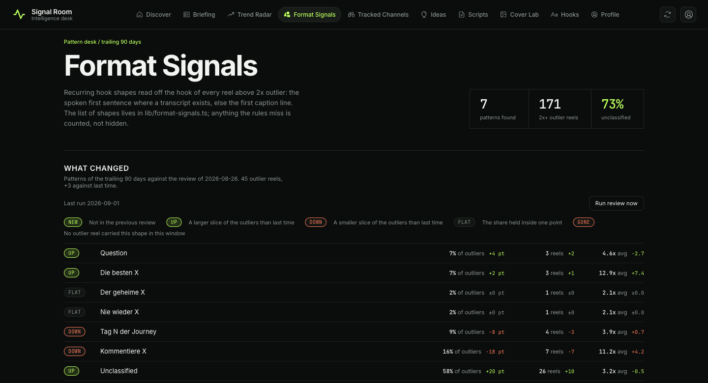 | 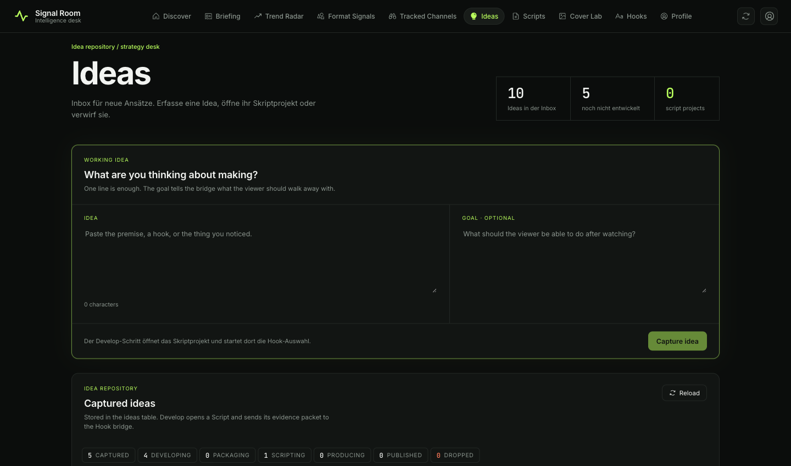 |
| **Hooks** | |
| 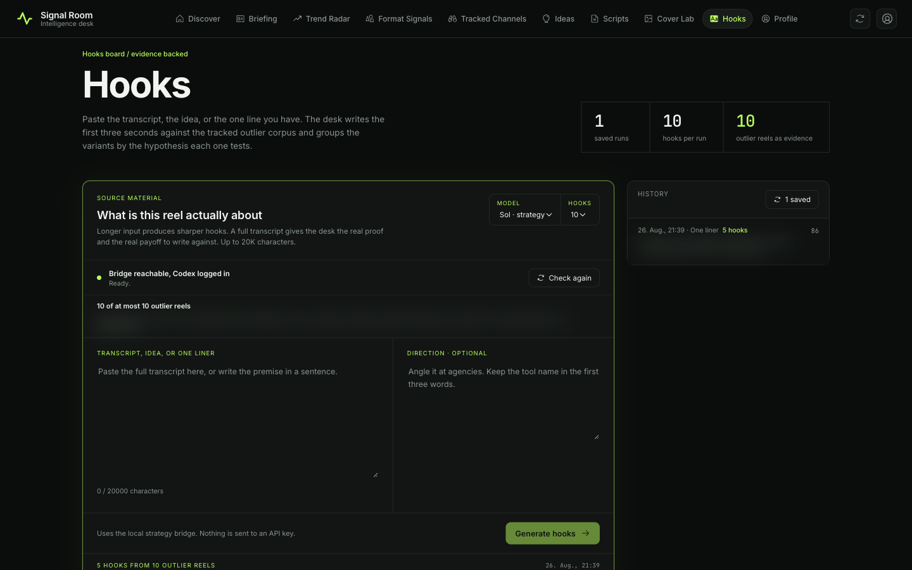 | |

**How this copy was cleaned:** real creator data (transcripts, Instagram test data, screenshots with faces and handles), all research and plan files and the local home path were removed from the whole history with `git filter-repo`. The Instagram test fixture was replaced with synthetic data. Commit dates and messages are unchanged; commits that only touched removed files are gone.


Signal Room collects public creator signals, ranks what deserves attention, turns evidence into a briefing, and develops ideas into reviewed Script drafts. It grew out of the clean-room starter that still sits at commit `37deeb0` on the public remote; everything since then is identity-specific and stays here. Source choices, scoring theory, prompts, and audience knowledge are part of the product now, not seams left open for someone else.

> [!IMPORTANT]
> The fixtures in `lib/demo-data.ts` are synthetic and only render when the store is empty. With a watchlist connected, every card, score and briefing comes from real collected data. The demo ranker is an educational example, not a recommendation system.

## What you get

| Surface | What works in the starter | What you replace |
|---|---|---|
| Discover | Synthetic feed, relative-reach context, ranked signal cards | Source connector and ranking method |
| Briefing | Daily document after every refresh: the ten strongest reels of the last 24 hours, one angle each, older days pickable | Your ranking weights, angle prompt, and editorial rubric |
| Production slate | Under the briefing: ten short-form starting points read from the same reels, each with a topic and its source reel; regenerate one, keep the rest; a direction for the next run; one click makes an idea | Your slate prompt, the direction you type, the size of the slate |
| Trend Radar | Daily Instagram hashtag sweep, German topic grouping, momentum and opportunity | Topic vocabulary and scoring window |
| Format Signals | Reusable content-format library | Your format taxonomy and performance evidence |
| Tracked Channels | Add-channel flow and daily-watch model | Validation, scheduling, collection, persistence |
| Ideas | Inbox for capture, Develop, Drop, Script links, and reviewable Storyboards | Your intake and production-stage policy |
| Cover Lab | Three cover packages for Reels and YouTube per developed Idea | Image testing data, brand system |
| Hooks | Hooks board: source material in, first-three-second variants grouped by hypothesis, run history | Your hook corpus, hypothesis set, and scoring rules |
| Profile | Adapter status and private-boundary reminder | Authentication, accounts, billing, team settings |

## The system at a glance

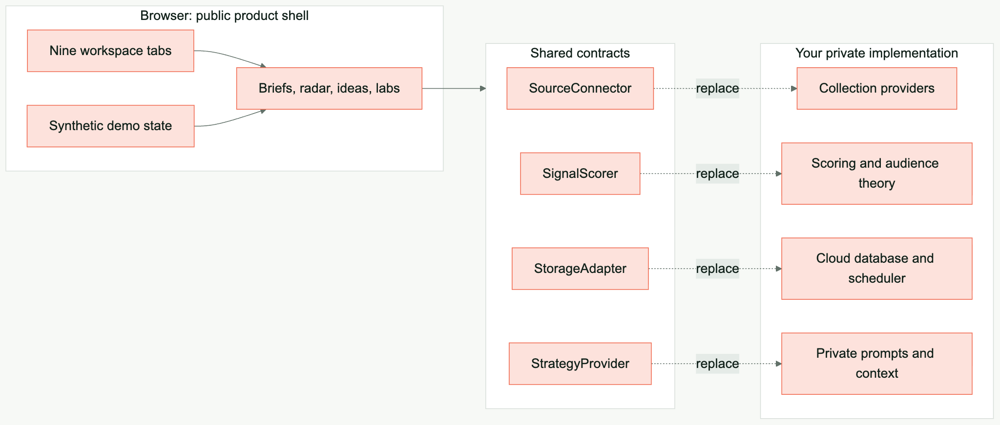

The contracts are the deliberate seam. The interface can remain recognizable while every meaningful intelligence decision is replaced.

## Quick start

Requirements: Node.js 22.18 or newer and npm. CI uses Node.js 22 so the test runner can import TypeScript directly.

```bash
git clone https://github.com/earlyaidopters/signal-room-starter.git
cd signal-room-starter
cp .env.example .env.local
npm install
npm run dev:web
```

Open [http://localhost:3000](http://localhost:3000). Demo mode needs no database, provider account, or AI credentials.

Run the full check before changing adapters:

```bash
npm run check
```

## How the data loop works

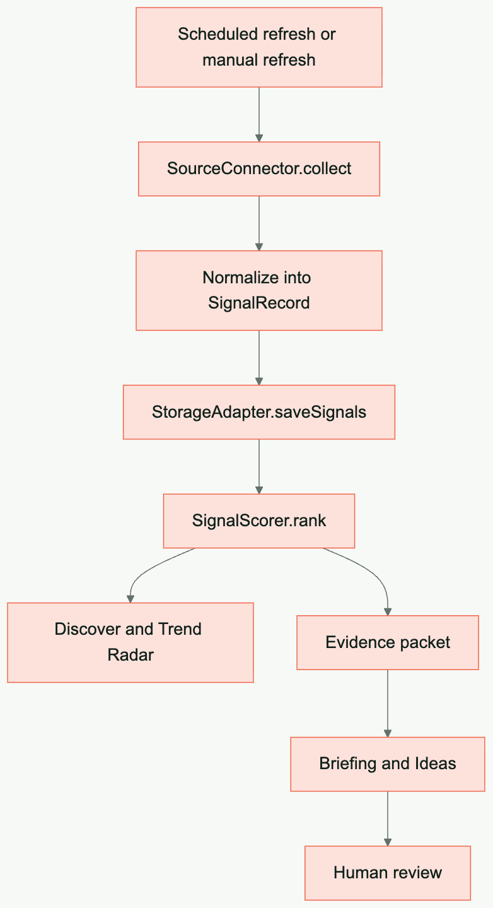

### What Refresh should mean in a production build

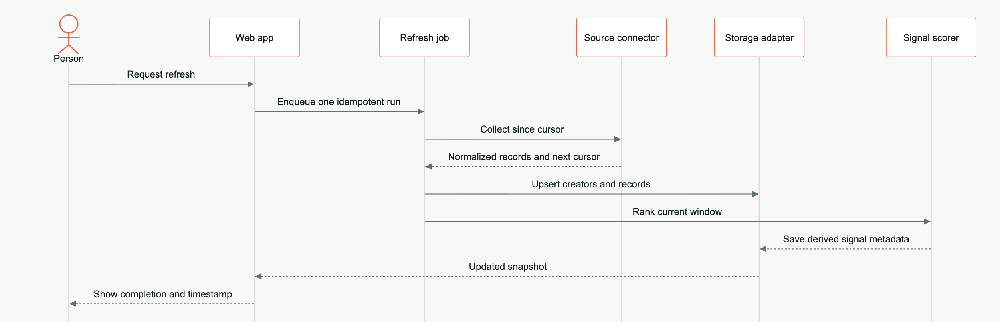

A browser button should not scrape an entire network directly. In a real deployment it should request a bounded background job, report its state, and render the last valid snapshot while work continues.

## Adding a tracked channel

The demo stores a new channel in browser memory. A production adapter should follow this lifecycle:

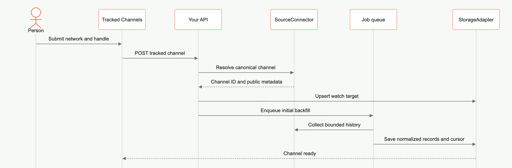

Build the handler to be idempotent. The same network and canonical channel ID should not create duplicate watch targets.

## The optional Codex bridge

The browser never imports the Codex SDK. A small Node process listens on `127.0.0.1`, validates a narrow evidence packet, starts a read-only Codex thread, and returns structured JSON.

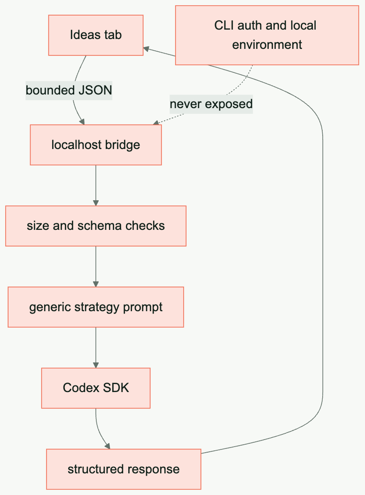

Start it in a second terminal:

```bash
npm run bridge
curl http://127.0.0.1:3211/health
```

`/health` answers `{ ok, service, codex }`, where `codex` is `logged-in` or `logged-out`. The Bridge-backed workflows use that state to distinguish reachable and logged in, not reachable, and Codex not logged in.

Then use **Generate angle** in Ideas. It sends the strongest outlier reels of the last 30 days from your stored corpus; with an empty store the app shows demo fixtures but sends nothing. Window, threshold and packet size live in `lib/config.ts`. The bridge:

- binds to localhost only
- allows configured browser origins only
- caps request bodies at 64 KB
- treats evidence text as untrusted input
- disables network search
- runs Codex with read-only sandboxing and no approvals
- requires a structured response schema, including the Cover-Lab route for format-specific packages and local image renders
- does not place auth material in client code
- refuses a run when Codex is not logged in, instead of spawning it

The Reel view also queues finished transcripts for a bounded content-analysis worker. Manual analysis and retry run through `/api/transcript-analyses`; cloud refreshes leave jobs queued until the local Bridge is available. The stored result names its text version, hash and analysis version, and every finding must match a literal source range.

Run one bounded local worker batch with `npm run worker:transcript-analysis`. An optional numeric argument such as `npm run worker:transcript-analysis -- 5` changes the batch size up to 20.

Queue up to 20 older finished transcripts before that worker pass with `curl -X POST http://localhost:3000/api/transcript-analyses -H 'content-type: application/json' -d '{"action":"catch-up","limit":20}'`. One request checks at most 1,000 finished Reels. If the response contains `nextCursor`, repeat the request with that value as `cursor` to continue after the last inspected Signal. Convex mode also requires the same random `TRANSCRIPT_ANALYSIS_WORKER_TOKEN` in `.env.local` and the Convex deployment. The token remains server-side.

```bash
curl -X POST http://localhost:3000/api/transcript-analyses -H 'content-type: application/json' -d '{"action":"catch-up","limit":20,"cursor":"ig-last-inspected"}'
```

The SDK uses the authentication context available to the local Codex CLI process. See the [official Codex documentation](https://developers.openai.com/codex/) for current setup guidance.

## The four extension contracts

```ts
interface SourceConnector {
  readonly id: string;
  collect(creators: Creator[]): Promise<SignalRecord[]>;
}

interface SignalScorer {
  rank(records: SignalRecord[], creators: Creator[], now?: Date): RankedSignal[];
}

interface StorageAdapter {
  listCreators(): Promise<Creator[]>;
  addCreator(creator: Creator): Promise<void>;
  listSignals(): Promise<SignalRecord[]>;
  saveSignals(records: SignalRecord[]): Promise<void>;
}

interface StrategyProvider {
  generate(request: StrategyRequest): Promise<StrategyResponse>;
}
```

They live in [`lib/contracts.ts`](lib/contracts.ts). Keep product components dependent on these contracts, not on vendor response objects.

## Make it yours

Choose one seam at a time.

### Replace the data source

1. Implement `SourceConnector` in `adapters/sources/your-provider.ts`.
2. Resolve each creator to a stable provider ID.
3. Store a per-channel cursor.
4. Normalize every item into `SignalRecord`.
5. Keep provider payloads out of UI components.

Trend Radar uses a separate Instagram hashtag adapter at `lib/adapters/sources/apify-instagram-hashtags.ts`. It normalizes Apify posts, keeps only German captions, assigns topics with keyword rules, and writes the bounded result to `hashtagPosts`. The Convex cron and `POST /api/trends` share the cost-guarded `runHashtagSweep`; X is not a source for this feature.

### Replace the ranker

1. Implement `SignalScorer`.
2. Write down what the score means before writing the formula.
3. Test monotonic properties and edge cases.
4. Store component evidence beside the final score.
5. Explain the result in human language in Discover.

### Add cloud persistence

1. Implement `StorageAdapter` for your database.
2. Use canonical IDs and unique constraints.
3. Separate raw records from derived rankings.
4. Make refresh jobs idempotent and resumable.
5. Keep credentials on the server.

### Change the strategy layer

1. Copy `bridge/request.mjs` into a private implementation.
2. Replace the generic prompt with your own editorial method.
3. Keep evidence bounded and source-linked.
4. Add approval gates before any external action.
5. Add evaluations before changing the model or prompt in production.

Full recipes are in [docs/CUSTOMIZATION.md](docs/CUSTOMIZATION.md).

## The public-private boundary

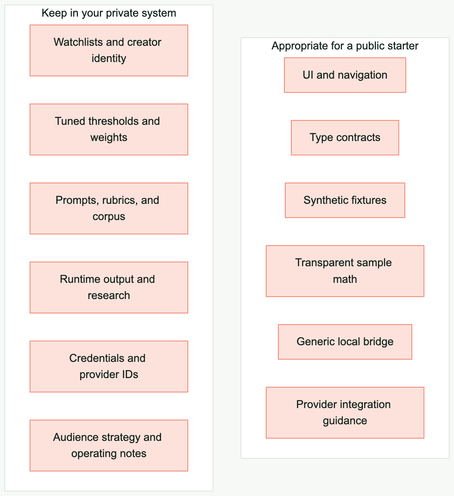

The boundary moved when this repository became private (ADR-0006). The public starter at `37deeb0` still holds the line in the diagram. Here, the watchlist, the outlier thresholds, the strategy prompts and the positioning are the product.

What stays out of Git even so:

- secrets, session material, tokens, cookies, and account identifiers
- everything in `.env.local`, including the strategy goal and audience
- the collected corpus and the cover cache (`data/`, ignored)
- the local issue tracker and review output (`.scratch/`, `reviews/`, ignored)

Read [docs/SECURITY.md](docs/SECURITY.md) before connecting any real account.

## Repository map

```text
app/                    Next.js shell and visual system
components/             Interactive workspace
lib/contracts.ts        Stable extension interfaces
lib/demo-data.ts        Synthetic fixtures, rendered only when the store is empty
lib/demo-score.ts       Transparent educational ranker
bridge/                 Optional localhost Codex process
tests/                  Contract and safety tests
docs/                   Architecture and build guides
.github/workflows/      Build and test checks
AGENTS.md                Cold-start instructions for coding agents
```

## Build with an agent

Start with this request:

```text
Read AGENTS.md and docs/AGENT-BUILD-GUIDE.md completely. Keep demo mode working.
Implement one adapter behind the existing contract. Do not copy scoring logic,
prompts, watchlists, or runtime data from another project. Show me the data flow,
tests, environment variables, and security boundary before connecting real data.
```

The build guide includes acceptance checks and a recommended sequence for agent-assisted implementation.

## Documentation

- [Architecture](docs/ARCHITECTURE.md)
- [Customization recipes](docs/CUSTOMIZATION.md)
- [Agent build guide](docs/AGENT-BUILD-GUIDE.md)
- [Security model](docs/SECURITY.md)
- [Contributing](CONTRIBUTING.md)

### Updating the diagrams

The rendered images are committed so GitHub mobile and other Markdown viewers never need Mermaid support. Edit the matching `.mmd` file in `docs/diagrams/sources`, then regenerate every image:

```bash
npm run diagrams
```

## License

MIT. Use the shell, replace the intelligence, and make the system genuinely yours.
