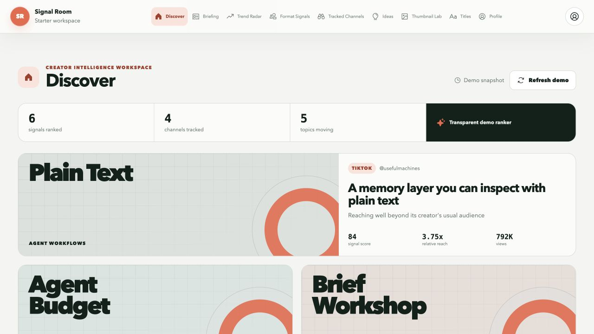
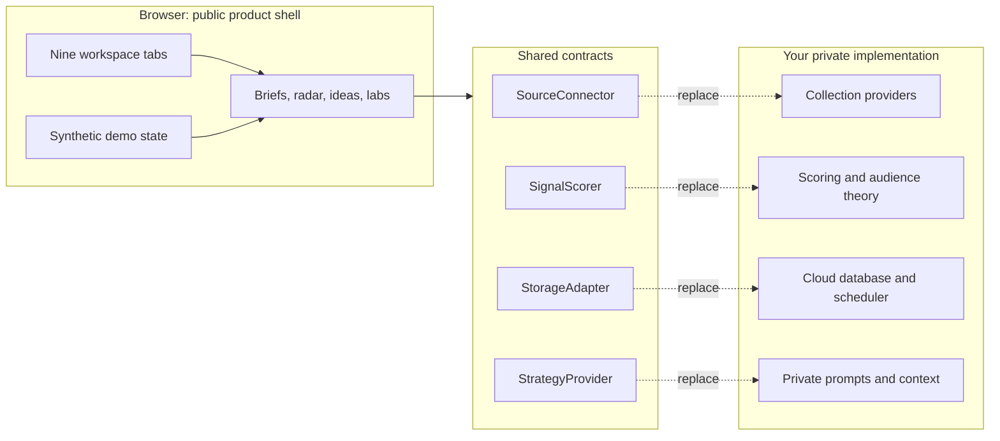
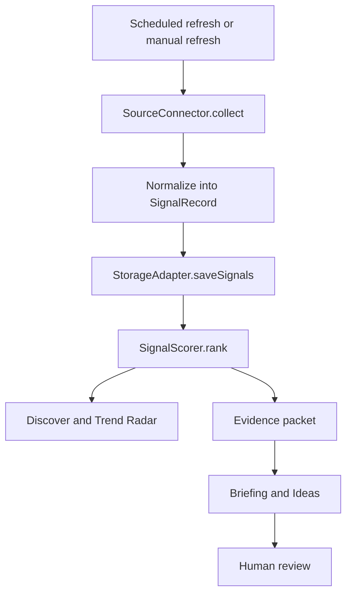
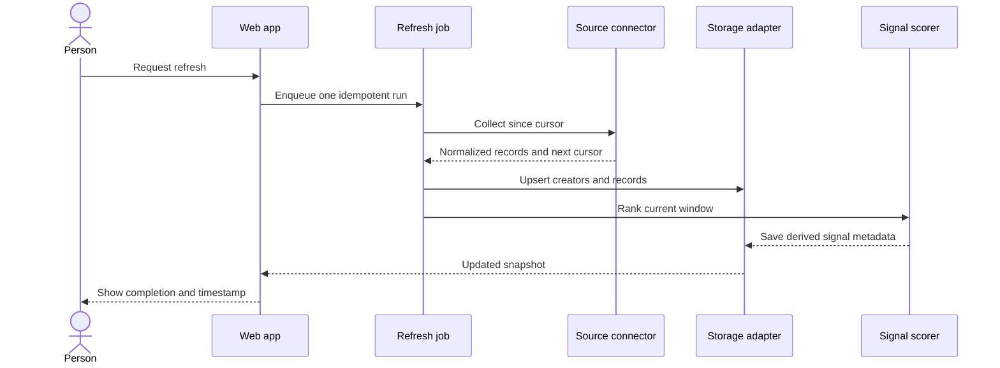
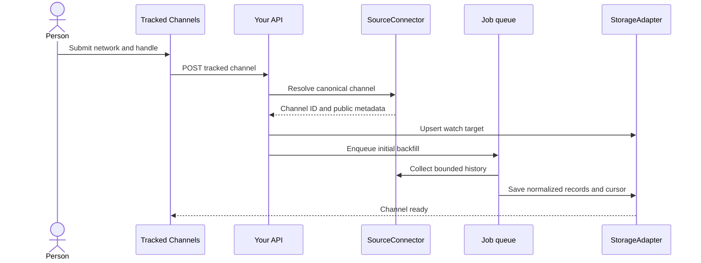
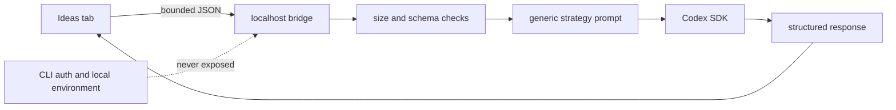
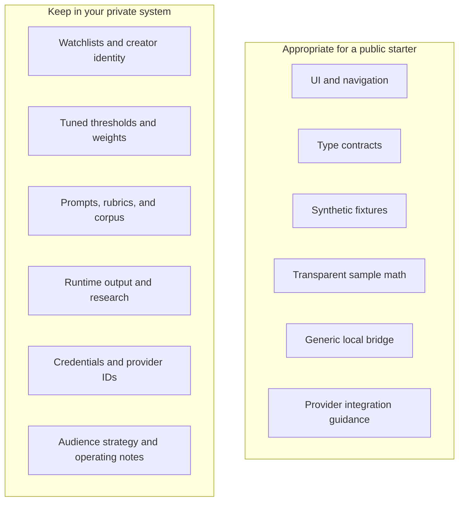

<div align="center">

# Signal Room Starter

### Build your own creator-intelligence workspace without inheriting someone else's private playbook.

**Synthetic demo data · Replaceable adapters · Optional local Codex bridge · Agent-ready documentation**

[Quick start](#quick-start) · [Architecture](#the-system-at-a-glance) · [Make it yours](#make-it-yours) · [Security boundary](#the-public-private-boundary)

</div>



Signal Room Starter is a clean-room foundation for collecting public creator signals, ranking what deserves attention, turning evidence into a briefing, and developing ideas. It gives you the product shell and the seams. Your source choices, scoring theory, private prompts, and audience knowledge stay yours.

> [!IMPORTANT]
> Every creator, signal, score, title, metric, and briefing included here is synthetic. The demo ranker is an educational example, not a recommendation system.

## What you get

| Surface | What works in the starter | What you replace |
|---|---|---|
| Discover | Synthetic feed, relative-reach context, ranked signal cards | Source connector and ranking method |
| Briefing | Evidence-linked editorial summary | Briefing composer and editorial rubric |
| Trend Radar | Topic grouping and momentum view | Trend detection and time-window logic |
| Format Signals | Reusable content-format library | Your format taxonomy and performance evidence |
| Tracked Channels | Add-channel flow and daily-watch model | Validation, scheduling, collection, persistence |
| Ideas | Idea workspace and local strategy request | Your strategy prompt, model policy, approval flow |
| Thumbnail Lab | Visual direction and constraint checklist | Image generation, testing data, brand system |
| Titles | Title workbench and intent labels | Your title corpus and scoring rules |
| Profile | Adapter status and private-boundary reminder | Authentication, accounts, billing, team settings |

## The system at a glance



The contracts are the deliberate seam. The interface can remain recognizable while every meaningful intelligence decision is replaced.

## Quick start

Requirements: Node.js 20 or newer and npm.

```bash
git clone https://github.com/earlyaidopters/signal-room-starter.git
cd signal-room-starter
cp .env.example .env.local
npm install
npm run dev:web
```

Open [http://localhost:3000](http://localhost:3000). Demo mode needs no database, provider account, or AI credentials.

Run the full check before changing adapters:

```bash
npm run check
```

## How the data loop works



### What Refresh should mean in a production build



A browser button should not scrape an entire network directly. In a real deployment it should request a bounded background job, report its state, and render the last valid snapshot while work continues.

## Adding a tracked channel

The demo stores a new channel in browser memory. A production adapter should follow this lifecycle:



Build the handler to be idempotent. The same network and canonical channel ID should not create duplicate watch targets.

## The optional Codex bridge

The browser never imports the Codex SDK. A small Node process listens on `127.0.0.1`, validates a narrow evidence packet, starts a read-only Codex thread, and returns structured JSON.



Start it in a second terminal:

```bash
npm run bridge
curl http://127.0.0.1:3211/health
```

Then use **Generate angle** in Ideas. The bridge:

- binds to localhost only
- allows configured browser origins only
- caps request bodies at 64 KB
- treats evidence text as untrusted input
- disables network search
- runs Codex with read-only sandboxing and no approvals
- requires a structured response schema
- does not place auth material in client code

The SDK uses the authentication context available to the local Codex CLI process. See the [official Codex documentation](https://developers.openai.com/codex/) for current setup guidance.

## The four extension contracts

```ts
interface SourceConnector {
  readonly id: string;
  collect(creators: Creator[]): Promise<SignalRecord[]>;
}

interface SignalScorer {
  rank(records: SignalRecord[], creators: Creator[], now?: Date): RankedSignal[];
}

interface StorageAdapter {
  listCreators(): Promise<Creator[]>;
  addCreator(creator: Creator): Promise<void>;
  listSignals(): Promise<SignalRecord[]>;
  saveSignals(records: SignalRecord[]): Promise<void>;
}

interface StrategyProvider {
  generate(request: StrategyRequest): Promise<StrategyResponse>;
}
```

They live in [`lib/contracts.ts`](lib/contracts.ts). Keep product components dependent on these contracts, not on vendor response objects.

## Make it yours

Choose one seam at a time.

### Replace the data source

1. Implement `SourceConnector` in `adapters/sources/your-provider.ts`.
2. Resolve each creator to a stable provider ID.
3. Store a per-channel cursor.
4. Normalize every item into `SignalRecord`.
5. Keep provider payloads out of UI components.

### Replace the ranker

1. Implement `SignalScorer`.
2. Write down what the score means before writing the formula.
3. Test monotonic properties and edge cases.
4. Store component evidence beside the final score.
5. Explain the result in human language in Discover.

### Add cloud persistence

1. Implement `StorageAdapter` for your database.
2. Use canonical IDs and unique constraints.
3. Separate raw records from derived rankings.
4. Make refresh jobs idempotent and resumable.
5. Keep credentials on the server.

### Change the strategy layer

1. Copy `bridge/request.mjs` into a private implementation.
2. Replace the generic prompt with your own editorial method.
3. Keep evidence bounded and source-linked.
4. Add approval gates before any external action.
5. Add evaluations before changing the model or prompt in production.

Full recipes are in [docs/CUSTOMIZATION.md](docs/CUSTOMIZATION.md).

## The public-private boundary



This repository intentionally does **not** include:

- a real creator watchlist
- production collection actors or provider IDs
- private outlier logic, thresholds, weights, or calibration data
- personal audience profiles or brand strategy
- historical runtime output, drafts, or research
- production prompts or evaluation sets
- secrets, session material, tokens, cookies, or account identifiers

Read [docs/SECURITY.md](docs/SECURITY.md) before connecting any real account.

## Repository map

```text
app/                    Next.js shell and visual system
components/             Interactive workspace
lib/contracts.ts        Stable extension interfaces
lib/demo-data.ts        Clearly synthetic fixtures
lib/demo-score.ts       Transparent educational ranker
bridge/                 Optional localhost Codex process
tests/                  Contract and safety tests
docs/                   Architecture and build guides
.github/workflows/      Build and test checks
AGENTS.md                Cold-start instructions for coding agents
```

## Build with an agent

Start with this request:

```text
Read AGENTS.md and docs/AGENT-BUILD-GUIDE.md completely. Keep demo mode working.
Implement one adapter behind the existing contract. Do not copy scoring logic,
prompts, watchlists, or runtime data from another project. Show me the data flow,
tests, environment variables, and security boundary before connecting real data.
```

The build guide includes acceptance checks and a recommended sequence for agent-assisted implementation.

## Documentation

- [Architecture](docs/ARCHITECTURE.md)
- [Customization recipes](docs/CUSTOMIZATION.md)
- [Agent build guide](docs/AGENT-BUILD-GUIDE.md)
- [Security model](docs/SECURITY.md)
- [Contributing](CONTRIBUTING.md)

## License

MIT. Use the shell, replace the intelligence, and make the system genuinely yours.
