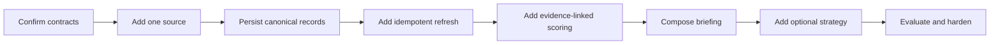

# Agent Build Guide

This guide is written for a coding agent entering the repository with no prior context.

## Mission

Turn the synthetic starter into a workspace-specific system without copying another person's private intelligence, data, or operating method.

## Cold-start sequence

1. Read `AGENTS.md`, `README.md`, `docs/ARCHITECTURE.md`, and `docs/SECURITY.md` completely.
2. Run `npm install` and `npm run check`.
3. Open demo mode and inspect every tab at desktop and mobile widths.
4. Read `lib/contracts.ts` and identify the one adapter in scope.
5. Produce a short data-flow and threat-boundary note before implementation.
6. Implement behind the existing contract.
7. Add focused tests and update the relevant documentation.
8. Run the full check and inspect the final interface.

## Questions the agent must answer

Before connecting a real source:

- What is the source's permission and terms boundary?
- What stable identifier represents a creator and a record?
- What is the rate-limit and retry policy?
- Where are credentials stored?
- What data is raw evidence and what data is derived?
- How is deletion or privacy change handled?

Before implementing a score:

- What exactly does the score mean?
- What is the comparison population?
- What time window and minimum sample apply?
- Which inputs can be missing or manipulated?
- What evidence is shown beside the result?
- How will a person challenge a ranking?

Before adding AI:

- Is AI required, or would deterministic code be clearer?
- What is the smallest input packet?
- Is untrusted content clearly delimited?
- What tools and network access are actually necessary?
- What is the structured output schema?
- Where does human approval happen?
- Which evaluation cases detect regressions?

## Recommended implementation order

Do not begin with the strategy model. Reliable evidence and explicit scoring semantics come first.

## Agent acceptance checklist

- demo mode still works
- no new secret or personal data is committed
- vendor SDKs stay behind adapters
- server-only dependencies never enter the browser bundle
- input validation and request bounds exist
- retries are bounded
- jobs are idempotent
- every displayed score has evidence and a reason
- mobile has no page-level horizontal overflow
- loading, empty, failure, and success states are present
- tests cover the new boundary
- documentation explains setup and teardown

## Safe handoff format

At the end of a task, report:

1. the adapter or boundary changed
2. files changed
3. environment variables added
4. data and trust flow
5. tests run and their result
6. known limitations
7. the next safest implementation step
