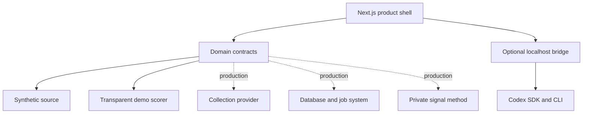
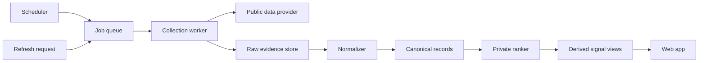

# Architecture

Signal Room Starter is split into a product shell, stable domain contracts, replaceable adapters, and an optional local strategy bridge.

## Design goals

- useful before any provider is configured
- explicit seams between product and private intelligence
- normalized records instead of provider-shaped UI
- evidence-linked rankings instead of unexplained scores
- background refresh instead of browser-side scraping
- local-first AI bridge with a narrow request surface

## Runtime topology

## Domain model

`Creator` identifies a watched public channel. `SignalRecord` is the normalized unit collected from a network. `RankedSignal` adds derived evidence and an explanation. `StrategyRequest` is a deliberately small packet sent to a strategy provider.

Raw provider payloads should be stored separately when needed for debugging or replay. Product components should never need them.

## Adapter responsibilities

### SourceConnector

- resolve stable creator identifiers
- collect a bounded time window or cursor delta
- handle provider pagination and limits
- normalize dates and metrics
- return `SignalRecord[]`

### SignalScorer

- define one documented meaning for the score
- rank a declared population and time window
- expose component evidence and a human-readable reason
- behave deterministically for the same inputs
- handle missing or zero-valued data safely

### StorageAdapter

- enforce unique canonical identities
- upsert creators and records idempotently
- store refresh cursors and job state
- separate raw evidence from derived results
- support the product's query patterns

### StrategyProvider

- accept bounded evidence, a goal, and an audience description
- treat evidence strings as untrusted source material
- return a structured, reviewable draft
- avoid autonomous external actions

## Recommended production layers

The UI should read the last complete snapshot. It should not wait for a full collection job in one browser request.

## Failure model

Collection, normalization, ranking, and strategy are separate failure domains. Record status and retry policy for each. Preserve the last known-good snapshot when a refresh fails.

Recommended job states: `queued`, `resolving`, `collecting`, `normalizing`, `ranking`, `complete`, and `failed`.

## Deployment note

The included Codex bridge is a local development bridge. Before deploying an AI endpoint, add real authentication, authorization, rate limiting, per-user isolation, audit logging, abuse controls, and a deployment-specific sandbox policy.
