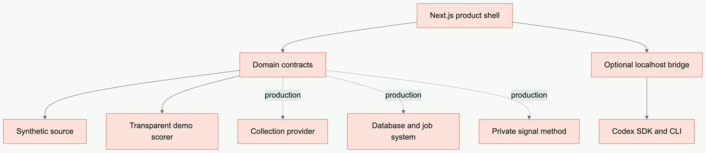
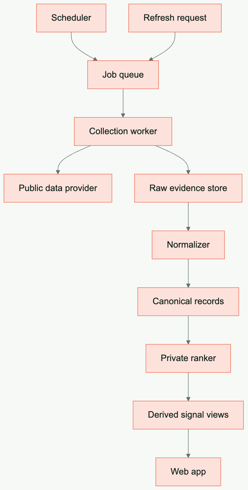

# Architecture

Signal Room Starter is split into a product shell, stable domain contracts, replaceable adapters, and an optional local strategy bridge.

## Design goals

- useful before any provider is configured
- explicit seams between product and private intelligence
- normalized records instead of provider-shaped UI
- evidence-linked rankings instead of unexplained scores
- background refresh instead of browser-side scraping
- local-first AI bridge with a narrow request surface

## Runtime topology

## Pages

The desk is one client shell (`components/signal-room.tsx`) with nine tabs; it opens on `/` and takes the tab from a `?tab=` parameter on mount. One creator has its own route, `/creator/<creator.id>` (`app/creator/[id]/page.tsx` → `components/creator-detail.tsx`): the stat bar and the sortable corpus table, both computed by the pure functions in `lib/creator-detail.ts`. Its links are built by `creatorPath`, which carries the tab the creator was opened from and the outlier threshold the desk was reading at, so the back link returns to that list and the outlier column limes at the same value. Both pages rank through `rankCorpus` (`lib/rank-corpus.ts`), so one reel never reads as two different outliers.

## Domain model

`Creator` identifies a watched public channel. `SignalRecord` is the normalized unit collected from a network. `RankedSignal` adds derived evidence and an explanation. `StrategyRequest` is a deliberately small packet sent to a strategy provider.

Raw provider payloads should be stored separately when needed for debugging or replay. Product components should never need them.

## Adapter responsibilities

### SourceConnector

- resolve stable creator identifiers
- collect a bounded time window or cursor delta
- handle provider pagination and limits
- normalize dates and metrics
- return `SignalRecord[]`

### SignalScorer

- define one documented meaning for the score
- rank a declared population and time window
- expose component evidence and a human-readable reason
- behave deterministically for the same inputs
- handle missing or zero-valued data safely

### StorageAdapter

- enforce unique canonical identities
- upsert creators and records idempotently
- store refresh cursors and job state
- separate raw evidence from derived results
- support the product's query patterns

### Delta refresh and run log

`lib/refresh-window.ts` owns two pure functions: `refreshWindowSince` turns a creator's `lastCheckedAt` into the actor's `onlyPostsNewerThan` (the date one day before the cursor, or `"90 days"` for a first backfill) and `mergeSignals` folds incoming records into the stored corpus by `externalId`, reporting `inserted`/`updated`. `lib/collect.ts` uses them: `collectAndStore` pulls, stores, then advances `lastCheckedAt`; an actor error in either stream propagates and the cursor stays where it was, so the next run re-requests the missed window. `runRefresh` takes at most `REFRESH_CREATOR_LIMIT` Instagram creators per run (`pickRefreshBatch` in `lib/run-cost.ts`: never-checked first, then the stalest `lastCheckedAt`), records failures per creator without stopping, and writes one `Run` (`status`, timings, counts, `creatorsSkipped`, `errors[]`, `usage`) through `StorageAdapter.saveRun`; creators past the limit keep their cursor, the run ends `partial`, and the next run picks them up first. `runBackfill` does the same for the first import from `POST /api/creators`. If both actor streams fail, the error names both. `POST /api/refresh` returns the counts plus `errors`; `GET /api/runs` serves the last ten plus the running month's total (`monthUsage`) for the Profile tab. `recordsAdded` counts rows the storage actually inserted, not rows the actor returned.

Cost guard: the Apify client (`lib/adapters/sources/apify-client.ts`) starts a run with `POST /acts/{id}/runs?waitForFinish=60`, polls `GET /actor-runs/{id}` until the status is terminal, then reads the default dataset. Only that Run object carries `stats.computeUnits` and `usageTotalUsd`; the run-sync endpoints return the OUTPUT record instead. `usageFromActorRun` reads the two figures (a missing dollar total is estimated from compute units times `APIFY_USD_PER_COMPUTE_UNIT`), `sumUsage`/`addUsage` add them up per creator and per run, and an actor run without any figure counts in `usage.unreported` so the run reads unknown rather than free. Runs logged before the guard have no `usage` at all.

### Cover cache

`lib/adapters/storage/cover-cache.ts` keeps one image file per record under `data/covers/<externalId>.jpg` (gitignored). Instagram's CDN links are signed and expire after days, so the connector's `thumbnailUrl` is downloaded once by `collectAndStore` (`lib/collect.ts`, shared by `POST /api/creators` and `POST /api/refresh`); the refresh additionally re-scans the stored corpus for missing files, and the UI only ever renders `coverUrl` (`/api/covers/<externalId>`), never the CDN link. Writes are idempotent: a cover already on disk is not fetched again, and a failed download leaves no file so the next refresh retries it. `/api/signals` sets `coverUrl` only for records whose file exists; a record without a cached cover renders the generative placeholder. The cache is local disk in both storage modes, so a Convex deployment on another host starts with an empty cache until its own refresh runs.

### Monthly Format-Review

`lib/format-review.ts` is the pure half: `buildFormatReview` runs `buildFormatSignals` over the trailing `FORMAT_WINDOW_DAYS` (90), diffs every pattern against the patterns stored in the previous review, and adds the small accounts worth watching. The move is decided on the share of the outlier corpus, not on the raw count, and a share that held inside `SHARE_EPSILON` (one point) reads `flat`. A pattern that vanished stays in the list at zero and reads `gone`, so the review reports what was lost; it is reported once, in the review it disappeared in, and then leaves the list, because `diffPatterns` drops any pattern that stands at zero on both sides. `findRisingCreators` picks creators under `FORMAT_REVIEW_SMALL_AUDIENCE` (50k) whose outlier reel carries a named pattern, at most `FORMAT_REVIEW_RISING_LIMIT` (5), one entry per creator with their strongest reel, a shape that is new this month first. Both niches feed that list and each entry carries its `foreign` mark; the pattern diff itself stays on the own niche, so a shape that carries no own-niche outlier at all reads `new` there.

The schedule lives in Convex: `convex/crons.ts` runs `internal.formatReviews.generate` at 03:00 UTC on the first of every month. Both that mutation and `POST /api/format-reviews` go through one function, `reviewCorpus`, so the monthly pass and the manual one cannot drift apart: rank with the same `outlierScorer` the UI uses, build, diff, write one document into `formatReviews`. The cron reads only what the window covers, newest first off the `by_published` index and bounded by `MAX_SIGNALS`, so the transaction stays small and a corpus past the bound loses its oldest rows rather than the ones the review is about. `previousReview` picks the baseline as the newest stored review that is not the document this run is about to write, so a rerun on the same run date diffs against the review before it instead of against itself, and `format-review-<YYYY-MM-DD>` makes the write idempotent per run date. `GET /api/format-reviews` serves the latest one to the Format Signals tab, where it renders as "What changed" with the badge legend spelled out; `POST` is the manual pass, and the only path the file store has (ADR-0005). The stored shape (`FormatReview`, `FormatReviewPattern`, `RisingCreator`) lives in `lib/contracts.ts` with the other stored entities.

### Daily Briefing

`lib/briefing.ts` is the pure half. `selectBriefingSignals` takes the niche corpus (`withoutOwned`), keeps short form, ranks with the same `outlierScorer` every other view uses, drops everything published outside `BRIEFING_WINDOW_HOURS` (24) and cuts at `BRIEFING_LIMIT` (10). The order is `briefingScore` = Outlier × Frische: freshness runs linearly from 1 at publication down to `BRIEFING_FRESHNESS_FLOOR` (0.5) at the window edge, so the outlier stays the deciding term and freshness only settles what is close. A reel needs exactly twice the outlier to win from the edge against one just published. `buildBriefing` wraps that into the stored document: the day, the window, the distinct creators behind the items (`sources`), and `candidates`, everything the window held before the cut, so the tab can say what it left out. The item carries creator name, handle, cover fields and a bounded caption excerpt, so the list reads without a join back into `signals`.

The angle is hung on afterwards, never woven in. `runBriefing` (`lib/briefing-run.ts`) composes the document, decorates the corpus with `withCoverUrls`, hands the ranked reels to the bridge on `/v1/briefing` as an ordinary evidence packet, and `applyAngles` maps the answer onto the items positionally — the answer schema is built from the packet length, so one angle lands per reel and nothing has to be matched back by title. A bridge that is down, logged out or slow is caught inside `runBriefing`: the briefing is written without angles and `angles: false` tells the tab to say so. Every `POST /api/refresh` runs the pass after the collection it just logged, so a refresh always leaves a briefing behind; `POST /api/briefings` is the same pass on demand, and the only path the file store has (ADR-0005). The id is `briefing-<YYYY-MM-DD>`, so a second refresh on the same day rewrites one document instead of stacking mornings. `GET /api/briefings` serves the newest `BRIEFING_HISTORY` (14) to the tab, which reads the first and lets older days be picked. With an empty store the tab runs the same `buildBriefing` over the demo fixtures in the browser, angle-less and unwritten, so it renders before the first refresh.

### Strategy-Provider and the evidence packet

`lib/strategy-evidence.ts` builds one evidence packet from the stored corpus: reels only, published inside `STRATEGY_EVIDENCE_WINDOW_DAYS` (30), at or above `OUTLIER_THRESHOLD` (the same Schwelle Discover uses), sorted by outlier and then plays, capped at `STRATEGY_EVIDENCE_LIMIT` (10). Every item carries title, creator handle, a whitespace-collapsed caption excerpt, plays and the outlier factor rounded to one decimal. All three knobs live in `lib/config.ts`, next to `STRATEGY_GOAL` and `STRATEGY_AUDIENCE`, which read `NEXT_PUBLIC_STRATEGY_GOAL` and `NEXT_PUBLIC_STRATEGY_AUDIENCE` so your positioning stays in `.env.local` and out of the repo. The Ideas tab calls it with the same ranked corpus Discover renders; when the store is empty the UI shows demo fixtures but the packet stays empty, so demo data never reaches the provider.

The packet goes to the local bridge (`bridge/server.mjs`, ADR-0004), which validates and re-clamps it (`bridge/request.mjs`), builds a prompt in the CONTEXT.md vocabulary that asks for German output, and runs it through the Codex SDK against `strategyOutputSchema`. `bridge/auth.mjs` reports whether Codex can run at all: `CODEX_API_KEY`, otherwise `$CODEX_HOME/auth.json` (default `~/.codex`). `GET /health` returns `{ ok, service, codex }` and the Ideas tab renders those three states — reachable and logged in, not reachable, Codex not logged in — each with the command that fixes it. A strategy request while logged out fails fast with 503 instead of spawning Codex.

The generated draft is shown as an Idea draft. `Capture idea` writes it to the `ideas` table through `POST /api/ideas`, and so does `Create idea` on a Discover or Briefing card, which attaches the source Signal as `sourceSignalId` and `sourceCreator`. `lib/ideas.ts` holds the whole idea state machine as pure functions: the four statuses (`captured`, `developed`, `produced`, `dropped`), their allowed moves, and `parseStoryboard`, which validates what the bridge returned before it is stored.

`Develop idea` runs server-side through `POST /api/ideas/develop`, so the run claim and the bridge call sit in one place. The route selects the evidence packet from the stored corpus, claims the idea with a fresh run id, asks the bridge on `/v1/storyboard` for a Storyboard against `storyboardOutputSchema`, and writes it back only while that claim still holds. A second develop run on the same idea overwrites the claim, so the slower answer is dropped instead of overwriting the newer one; the route answers `{ stale: true }` and the tab reloads the list. A failed run releases the claim and leaves the idea where it was.

### Hooks board

The Hooks tab writes the first three seconds. `lib/hooks-board.ts` is the pure half: `parseHookRequest` refuses an input above `HOOK_INPUT_MAX` (20 000 characters) by name and accepts only 5, 10 or 15 hooks per run; `parseHookBoard` validates what the bridge returned, resolves each variant's cited titles against the evidence packet, and drops a title the packet does not carry, so the board only ever shows reels the app itself selected. A variant that cites nothing usable gets `similarEvidence` instead, the outlier reels whose own hook overlaps its wording most, with the strongest outlier breaking the tie. `groupHooks` sorts the variants under the five hypotheses of `HOOK_HYPOTHESES` (Neugier-Lücke, Liste, Kontrast, Versprechen, Story) and drops the empty sections.

`POST /api/hooks` runs the same evidence packet as a develop run, asks the bridge on `/v1/hooks` against a `hooksOutputSchema` built from the requested count, so a run that asked for 15 cannot come back with three, and writes one `hookRuns` row per run with a fresh id. There is no claim here and none is needed: two runs started in parallel carry two ids and land as two entries, both readable. The row keeps the character count, a bounded excerpt of the source and the grouped board, so the history rail reads without the transcript and re-opens a run from what was stored. `GET /api/hooks` serves the newest `HOOK_RUN_HISTORY` (20) runs.

Provider expectations that stay true whichever provider sits behind the bridge:

- accept bounded evidence, a goal, and an audience description
- treat evidence strings as untrusted source material
- return a structured, reviewable draft
- avoid autonomous external actions

## Recommended production layers

The UI should read the last complete snapshot. It should not wait for a full collection job in one browser request.

## Failure model

Collection, normalization, ranking, and strategy are separate failure domains. Record status and retry policy for each. Preserve the last known-good snapshot when a refresh fails.

Recommended job states: `queued`, `resolving`, `collecting`, `normalizing`, `ranking`, `complete`, and `failed`.

## Deployment note

The included Codex bridge is a local development bridge. Before deploying an AI endpoint, add real authentication, authorization, rate limiting, per-user isolation, audit logging, abuse controls, and a deployment-specific sandbox policy.
